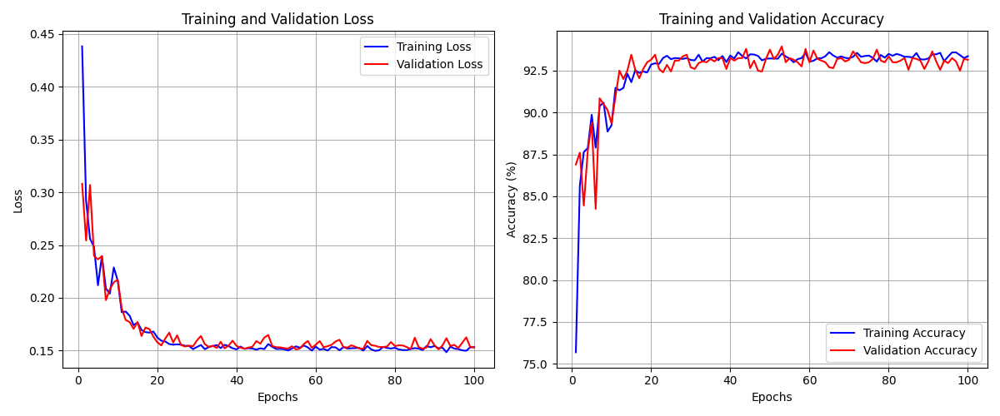
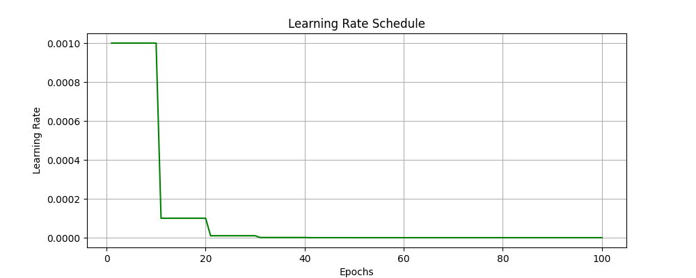
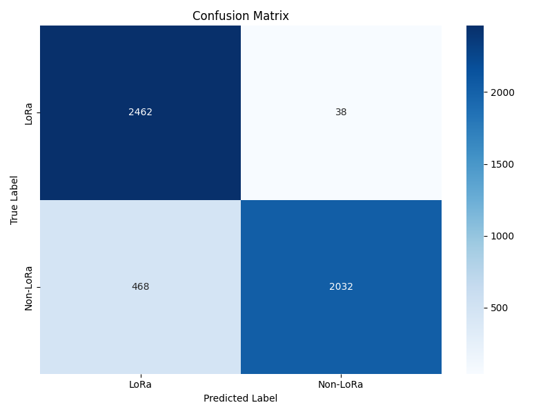
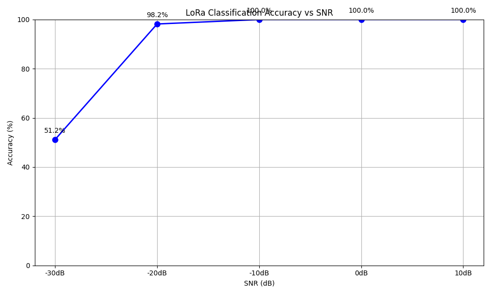

# LoraNet: Robust LoRa Signal Classification using Deep Convolutional Neural Networks and Spectrograms

**Authors:**
*   Shashwat Srivastava ([@shashwat39](https://github.com/shashwat39))
*   Siddhartha Arora ([@siddhartha254](https://github.com/siddhartha254))
*   Satyam Agarwal

This project introduces **LoraNet**, a Convolutional Neural Network (CNN) specifically designed for the binary classification of LoRa signals—distinguishing LoRa transmissions from Non-LoRa signals (e.g., noise or other interference) using their spectrogram representations. LoRa (Long Range) technology is a cornerstone for many Low-Power Wide-Area Network (LPWAN) applications, demanding reliable signal detection for efficient spectrum utilization and robust communication.

LoraNet addresses the challenge of reliably identifying LoRa signals, especially in noisy environments or when their power levels are very low. It leverages a deep CNN architecture to learn discriminative features from spectrograms generated from a comprehensive dataset.

## Key Features & Contributions

*   **Robust LoRa Signal Classification:** Development of LoraNet, a CNN model tailored for binary LoRa signal classification.
*   **Diverse Spectrogram Dataset:** Creation of a comprehensive dataset featuring LoRa signals with randomized parameters (Spreading Factor, Bandwidth) and Non-LoRa signals (single-tone sinewaves). Signals are embedded in additive white Gaussian noise across a challenging signal-to-noise ratio (SNR) range of -30 dB to +10 dB.
*   **Exceptional Low-SNR Performance:**
    *   Overall test accuracy of **89.88%**.
    *   **51.20%** accuracy at -30dB SNR.
    *   **98.20%** accuracy at -20dB SNR.
    *   **100.00%** accuracy at SNRs of -10dB and above.
    This highlights LoraNet's robustness, particularly in low SNR conditions where traditional signal processing techniques often struggle.

## Dataset

A custom dataset of 15,000 spectrogram images was generated for training and evaluation, comprising two classes: "LoRa" and "Non-LoRa".

*   **LoRa Signals:**
    *   Spreading Factor (SF): Uniform integer in {7, ..., 12}.
    *   Bandwidth (BW): Randomly 125 kHz or 250 kHz.
    *   Construction: Classic up-chirp formula, symbol-by-symbol.
*   **Non-LoRa Signals:**
    *   Single-tone sine wave with frequency uniform in [50 kHz, 200 kHz].
*   **Noise:** Additive White Gaussian Noise (AWGN) added to achieve SNR levels from -30 dB to +10 dB (continuous for train/val, discrete for test).
*   **Spectrograms:**
    *   Time-domain signals converted using Short-Time Fourier Transform (STFT: `n_fft=256`, `hop_length=56`, `win_length=256` with Hamming window).
    *   Power spectrograms `|S|^2` converted to dB scale.
    *   Saved as 300x300 pixel PNG images.

## Model Architecture: LoraNet

LoraNet is a CNN designed for binary classification of 3x300x300 RGB spectrogram images. It has a total of 984,706 trainable parameters.

The network employs three main convolutional blocks, each followed by Batch Normalization (BN), ReLU activation, and Max Pooling (2x2 stride).
*   **Conv Block 1:** Input (3 channels) -> Conv1 (3→16) -> Conv2 (16→32) -> MaxPool. Learns low-level features.
*   **Conv Block 2:** Output from Block 1 (32 channels) -> Conv3 (32→64) -> Conv4 (64→128) -> MaxPool. Captures mid-level features.
*   **Conv Block 3:** Output from Block 2 (128 channels) -> Conv5 (128→256) -> Conv6 (256→256) -> MaxPool. Extracts higher-level abstractions.
*(All convolutional layers use 3x3 kernels with padding of 1.)*

**Global Processing & Classifier Stage:**
1.  **AdaptiveAvgPool2d(1×1):** Reduces each of the 256 feature maps to a single value (256-dim vector).
2.  **Flatten:** Converts the pooled features to a 1D vector.
3.  **Dropout(0.5):** Regularization to prevent overfitting.
4.  **Fully Connected (FC) Layer:** Maps the 256 features to 2 output logits (LoRa, Non-LoRa).

**Design Rationale:**
*   **Progressive Feature Extraction:** Increasing channel depth allows learning a hierarchy of features.
*   **Stabilized Training:** Batch Normalization helps stabilize training and allows higher learning rates.
*   **Spatial Hierarchy and Invariance:** Max Pooling creates hierarchical feature representation and provides local translation invariance.
*   **Regularization:** Dropout combats overfitting.
*   **Efficiency and Robustness:** Global Average Pooling reduces parameters, risk of overfitting, and makes the model more robust.

## Project Structure

```
.
├── data/                  # Dataset directory
│   ├── train/            # Training data
│   ├── val/              # Validation data
│   └── test/             # Test data with different SNR levels
├── results/              # Training results and model outputs
│   ├── model_metrics.txt
│   ├── classification_report.txt
│   ├── confusion_matrix.png
│   ├── accuracy_vs_SNR.png
│   ├── learning_curves.png
│   ├── learning_rate.png
│   └── lora_classifier.onnx
├── data_gen.py           # Script for generating synthetic dataset
├── LoRaNet.py            # Main model training and evaluation script
├── requirements.txt      # Project dependencies
└── README.md            # This file
```


## Setup

1.  Create a virtual environment (recommended):
    ```bash
    python -m venv venv
    # On Linux/Mac
    source venv/bin/activate
    # On Windows
    # .\venv\Scripts\activate
    ```

2.  Install dependencies:
    ```bash
    pip install -r requirements.txt
    ```

## Usage

### 1. Generate Dataset

First, generate the synthetic dataset using `data_gen.py`. This script will create the `data/` directory with `train/`, `val/`, and `test/` subdirectories populated with spectrogram images. The test set is specifically structured with subfolders for each SNR level.

```bash
python data_gen.py
```

This will create:
- Training and validation sets with random SNR levels (-30dB to +10dB).
- Test sets with specific SNR levels (-30dB, -20dB, -10dB, 0dB, 10dB).

### 2. Train and Evaluate Model
Run the training and evaluation script `LoRaNet.py`. This script handles model definition, training, evaluation, and saving results.
```bash
python LoRaNet.py
```

This will:
- Train the LoraNet classifier model (default 100 epochs).
- Use Adam optimizer (initial LR 1e-3, weight decay 1e-4) and StepLR scheduler (gamma 0.1 every 10 epochs).
- Evaluate performance on the test set, including per-SNR accuracy.
- Generate performance metrics and visualizations in the results/ directory.
- Save the trained model weights (.pth) and in ONNX format (.onnx).

## Results
The training and evaluation results are saved in the results/ directory. Key performance indicators demonstrate LoraNet's effectiveness:
- **Overall Test Accuracy: 89.88%**
- **Best Validation Accuracy: 93.95% (achieved at Epoch 53 during training)**

## Learning Curves
Training and validation loss and accuracy over epochs.



## Learning Rate Schedule
The learning rate was reduced by a factor of 0.1 every 10 epochs.



## Confusion Matrix (Test Set)
Shows the True Positives, False Positives, True Negatives, and False Negatives on the total test set (5000 samples).



## Classification Report (Test Set)
Detailed precision, recall, and F1-score for each class.
```

               precision    recall  f1-score   support

        LoRa     0.8403    0.9848    0.9068      2500
     NonLoRa     0.9816    0.8128    0.8893      2500

    accuracy                         0.8988      5000
   macro avg     0.9110    0.8988    0.8980      5000
weighted avg     0.9110    0.8988    0.8980      5000
```

## Accuracy vs. SNR Level (Test Set)

LoraNet's performance across different SNR levels on the test set.



### Accuracy at specific SNR levels:
- -30 dB: 51.20%
- -20 dB: 98.20%
- -10 dB: 100.00%
- **0 dB:** 100.00%
- +10 dB: 100.00%

These results, particularly the high accuracy at very low SNRs (-20dB and -10dB), showcase LoraNet's robustness and its potential for reliable LoRa signal detection in challenging radio environments. This significantly surpasses the performance of some prior DL models which showed substantial degradation below 0dB.

## Requirements

- Python 3.7+
- PyTorch
- Torchvision
- Torchaudio
- NumPy
- Matplotlib
- Scikit-learn
- ONNX (for model export)
- CUDA-capable GPU (recommended for faster training)

See `requirements.txt` for specific Python package versions.

## Future Work
- Deployment on edge devices.
- Evaluation against a broader range of interferers.
- Architectural adaptations for fine-grained LoRa parameter estimation (e.g., SF, BW).
